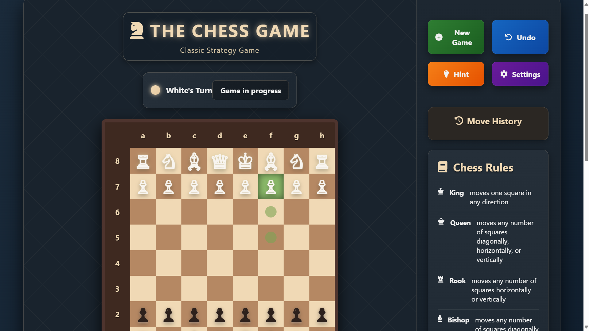

# THE CHESS GAME

A modern, interactive web-based chess game with a beautiful UI, move history, captured pieces display, and built-in chess rules reference. Built using HTML, CSS and JavaScript.

## Features

- **Interactive Chessboard**: Drag-and-drop pieces, legal move highlighting, and real-time updates.
- **Move History**: Track all moves made during the game.
- **Captured Pieces**: See which pieces have been captured by each player.
- **Player Turn Indicator**: Visual cue for whose turn it is.
- **Game Status**: Displays current game state (in progress, check, checkmate, stalemate, etc.).
- **Chess Rules Reference**: Quick guide to chess piece movements and special rules.
- **Controls**: New Game, Undo, Hint, and Settings buttons for enhanced gameplay.
- **Responsive Design**: Works well on desktop and mobile devices.

## Technologies Used

- **HTML5 & CSS3**: Structure and styling
- **JavaScript (ES6+)**: Game logic and interactivity
- **[jQuery](https://jquery.com/)**: DOM manipulation
- **[chess.js](https://github.com/jhlywa/chess.js/)**: Chess rules and move validation
- **[chessboard.js](https://chessboardjs.com/)**: Interactive chessboard UI
- **[Font Awesome](https://fontawesome.com/)**: Icons
- **[Animate.css](https://animate.style/)**: Animations
- **[Clipboard.js](https://clipboardjs.com/)**: Copy-to-clipboard functionality
- **[Normalize.css](https://necolas.github.io/normalize.css/)**: CSS normalization

## Getting Started

1. **Clone or Download** this repository.
2. **Open `index.html`** in your web browser.
3. **Play Chess!**

No build steps or server required—everything runs in the browser.

## File Structure

- `index.html` — Main HTML file
- `style.css` — Custom styles
- `script.js` — Game logic and UI interactions

## Screenshots

